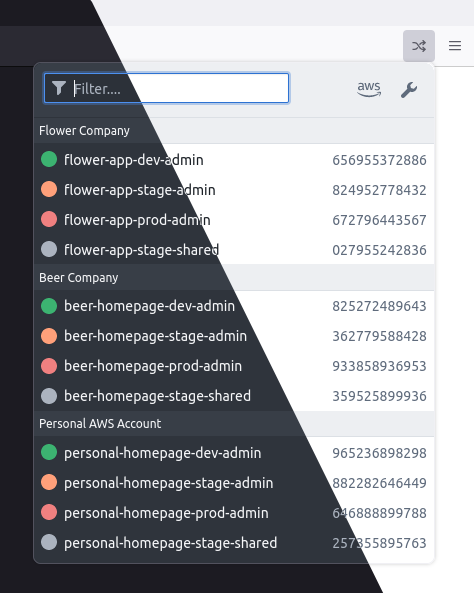
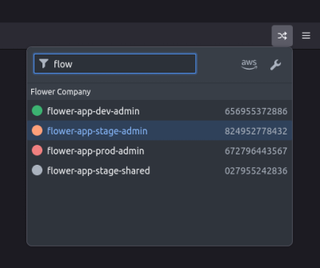

# aws role switch

A browser plugin to quickly switch between aws roles.

**Features:**
  * Role editor (`codemirror`)
  * AWS Config `ini` format
  * Group roles
  * Open popup via hotkey: `Ctrl-Shift-l`
  * Navigate via arrow keys between roles, press `Enter` to assume a role
  * Neat dark/light theme based on your browser settings

## Screenshots


<br />


## Development

```sh
npm i
npm start # start dev server
npm bundle # build distribution zip
```
