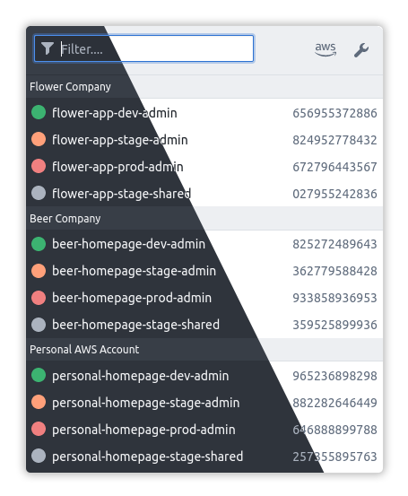

## AWS role switch

Browser plugin to quickly switch between roles on the AWS console

<a href="https://github.com/janstuemmel/aws-role-switch" target="_blank">GitHub</a>
<a href="https://github.com/janstuemmel/aws-role-switch" target="_blank">Firefox</a>
<a href="https://github.com/janstuemmel/aws-role-switch" target="_blank">Chrome</a>
<a href="#/?id=aws-role-switch">Getting Started</a>