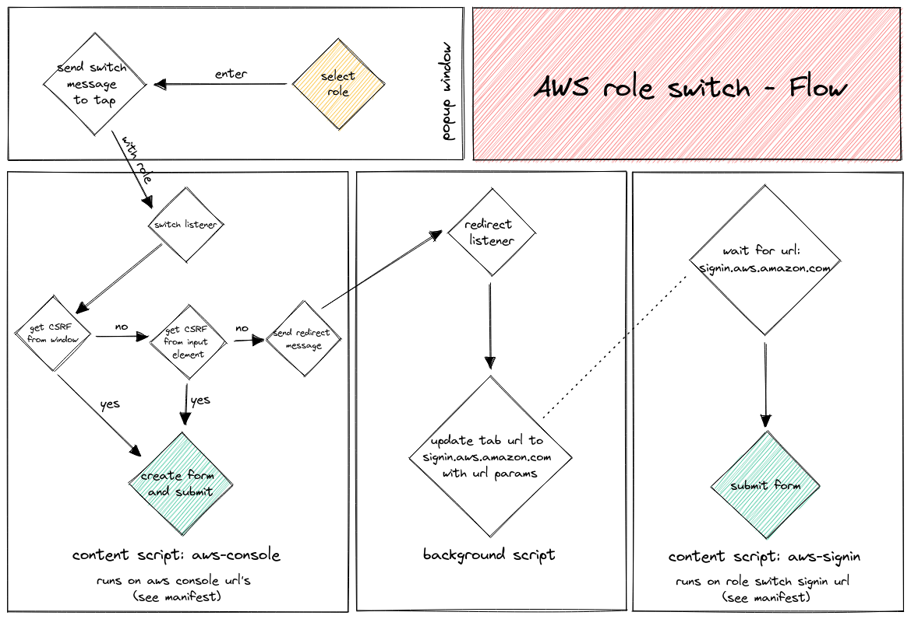

# Flow

Here's a little diagram of how the application flow works.

<picture>
  <source media="(prefers-color-scheme: dark)" srcset="img/flow-dark.png">
  <source media="(prefers-color-scheme: light)" srcset="img/flow-light.png">
  
</picture>